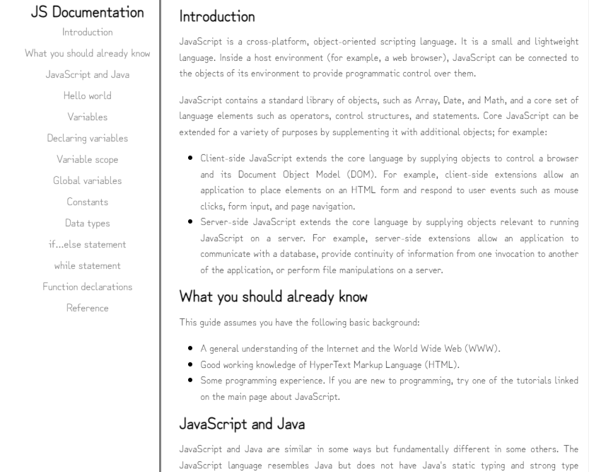

# TechnicalDocumentationPage
Projeto elaborado no curso Responsive Web Design do freeCodeCamp.

Objetivo: criar uma aplicação que funcione de modo semelhante a https://technical-documentation-page.freecodecamp.rocks

Resultado: https://narahsouza.github.io/DocumentationPage/

